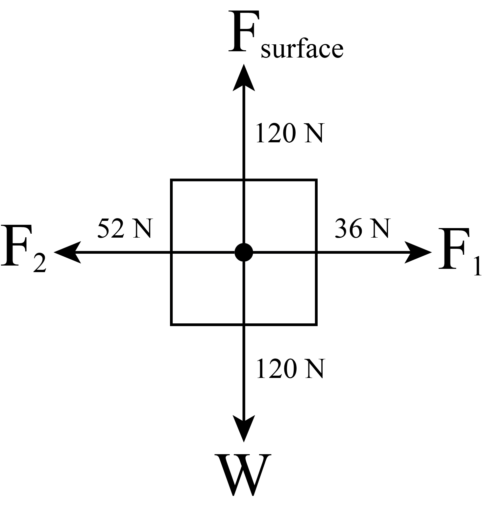
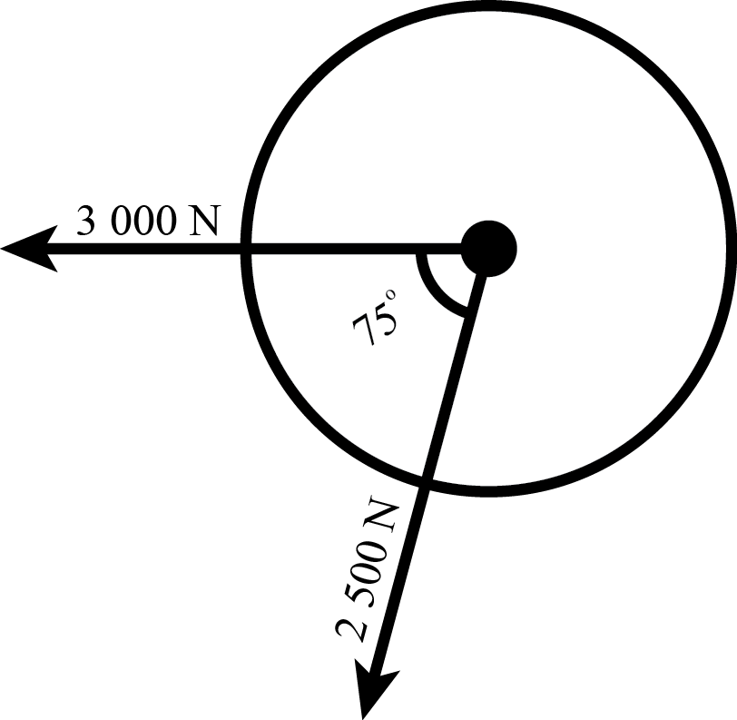
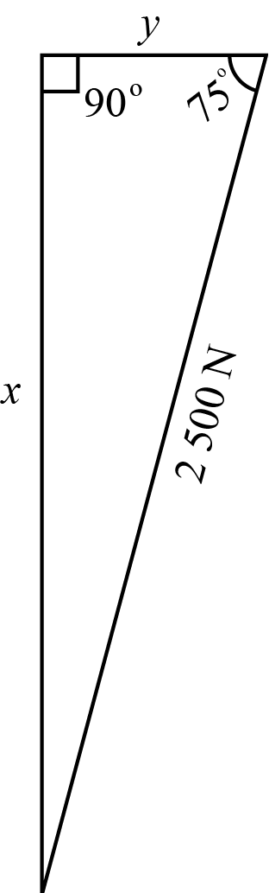
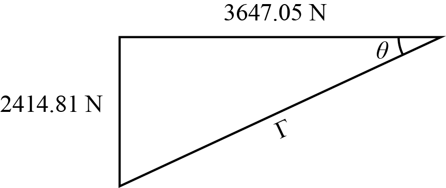
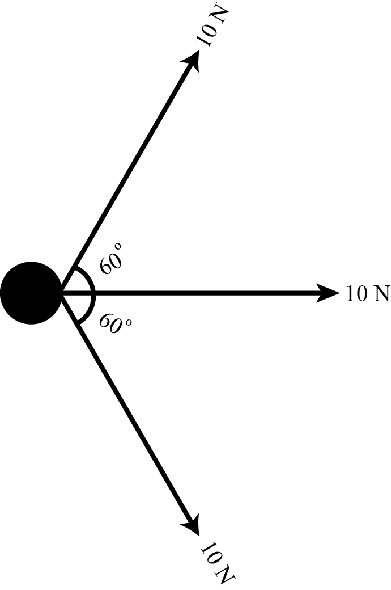
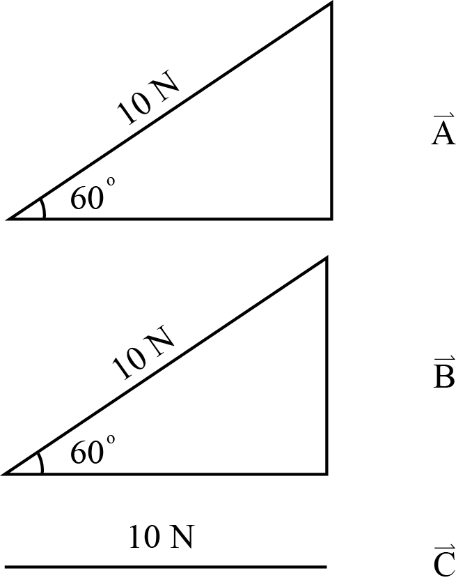
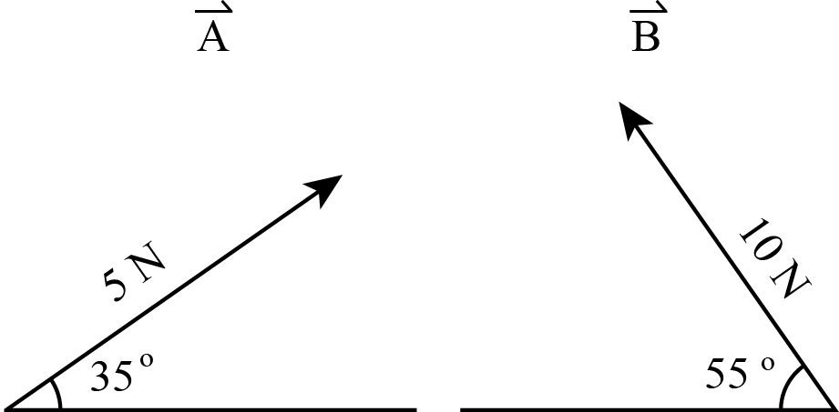

# Question 2

``` {r free-body-diagram, fig.cap="Question 2", fig.width=3, echo = FALSE}

```

According to Figure \@ref(fig:free-body-diagram), the net force is \(52 - 36 = 16~\text{N}\).

# Question 4

The situation is illustrated in the image.

``` {r tractors-pulling, fig.cap = "Tractor and Rocks Free Body Diagram", echo = FALSE}

```

As shown in Figure \@ref(fig:tractors-pulling), there are essentially two vectors. The first is \(\vectorarrow{A} = 3 000 \si{N} [W]\) and the second is \(\vectorarrow{B} = 2 500 \si{N} [W 75 \degree S]\). We are looking for the vector produced when \(\vectorarrow{A} + \vectorarrow{B}\). Since \(\vectorarrow{A}\) is in one direction, we only need to concern ourselves with \(\vectorarrow{B}\). We can decompose \(\vectorarrow{B}\) into a triangle with sides \(x\) and \(y\) and solve for these sides using trigonometry, as shown in Figure \@ref(fig:triangle-trig-1).

``` {r, triangle-trig-1, fig.cap="Trigonometry", echo=FALSE}

```

\begin{eqnarray}
\sin (75) & = & \frac{x}{2 500} \\
          & = & 2414.81 \\
\end{eqnarray}

\begin{eqnarray}
\cos 75 & = & \frac{y}{2500} \\
        & = & 647.05
\end{eqnarray}

Now, we combine the decomposed \(\vectorarrow{B}\) with \(\vectorarrow{A}\). The horizontal component is \(3 000 + 647.05 = 3647.05 \si{N}\) and the vertical is \( 2414.81 \si{N}\). Now, we can solve for the hypoteneuse, \(\Gamma\), and the angle \(\theta\), as shown in Figure \@ref(fig:trig-2).

``` {r trig-2, fig.cap="Solving for the hypoteneuse and the missing angle", echo = FALSE}

```

\begin{eqnarray}
  \Gamma & = & \sqrt{3647.05^2 + 2414.81^2} \\
         & = & 4374.05
\end{eqnarray}

\begin{eqnarray}
  \tan\theta & = & \frac{2414.81}{3647.05} \\
  \theta & = & \tan^{-1}\left( \frac{2414.81}{3647.05} \right) \\
  & \approx & 33.5 \degree 
\end{eqnarray}

Therefore, the missing vector is \(\vectorarrow{V} = 4373.99~\si{N} [W 33.4 \degree S]\)

# Question 7

``` {r question-7, fig.cap="Question 6", echo=FALSE}

```

Figure \@ref(fig:question-7) can essentially be reduced to three vectors, \(\vectorarrow{A}\), \(\vectorarrow{B}\), and \(\vectorarrow{C}\), as shown in  \@ref(fig:3-vectors)

``` {r 3-vectors, fig.cap="Decomposed question 7", echo=FALSE}

```

Note that the sign convention has been ignore for simplicity. We can decompose \(\vectorarrow{A}\) into a horizontal and vertical component using trigonometry. \(\vectorarrow{C}\) does not need to be decomposed, as it is only in one direction.

\begin{eqnarray}
\sin 60 & = & \frac{x}{10} \\
      x & = & 10\sin 60 \\
      x & = & 5\sqrt{3}
\end{eqnarray}

The vertical component is \(5\sqrt{3}\).

\begin{eqnarray}
\cos 60 & = & \frac{y}{10} \\
    y   & = & 5
\end{eqnarray}

The horizontal part of the component is five. Now, we don't need to calculate \(\vectorarrow{B}\) as it's components are the opposite of \(\vectorarrow{A}\). Thus, the vertical components cancel each other out as \(5\sqrt{3} - 5\sqrt{3} = 0\). The net force is therefore equal to sum of the vertical vectors.

\begin{eqnarray}
F_\text{net} & = & 5 + 5 + 10 \\
             & = & 20 \\ 
\end{eqnarray}

Therefore, the final vector is \(\vectorarrow{V} = 20 \si{N} [E]\).

# Question 8

This question essentially describes two vectors, as shown in Figure \@ref(fig:2-vectors).

``` {r 2-vectors, fig.cap="Question 8", echo=FALSE}

```

We will be solving for \(\vectorarrow{V} = \vectorarrow{A} + \vectorarrow{B}\).

First, we decompose the vectors. I will decompose them into \(\alpha\), \(\beta\), \(\gamma\), and \(\delta\).

\begin{eqnarray}
\sin 35 & = & \frac{\alpha}{5} \\
  x & = & 2.87
\end{eqnarray}

\begin{eqnarray}
\cos 35 & = & \frac{\beta}{5} \\
        & = & 4.10
\end{eqnarray}

\begin{eqnarray}
\sin 55 & = & \frac{\gamma}{10} \\
 \gamma & = & 8.19
\end{eqnarray}

\begin{eqnarray}
\cos 55 & = & \frac{\delta}{10} \\
        & = & 5.74
\end{eqnarray}

Now, we must add the magnitudes while respecting the sign convention. The convention I have chosen is Cartesian; right and up are positive. The vertical portion of the vector is \(2.87 +8.19= 11.06\). The horizontal is \(5.74 - 4.10 = 1.64\).

We can now calculate the hypotenuse and the angle.

\begin{eqnarray}
\text{hyp} & = & \sqrt{11.06^2 + 1.64^2} \\
           & = & 11.18
\end{eqnarray}

\begin{eqnarray}
\tan\theta & = & \frac{11.06}{1.64} \\
    \theta & = & \tan ^{-1}\left(\frac{11.06}{1.64}\right) \\
           & = & 81.57
\end{eqnarray}

Therefore, the \(\vectorarrow{A} = 11.18\si{N}[L82\degree U]\)
